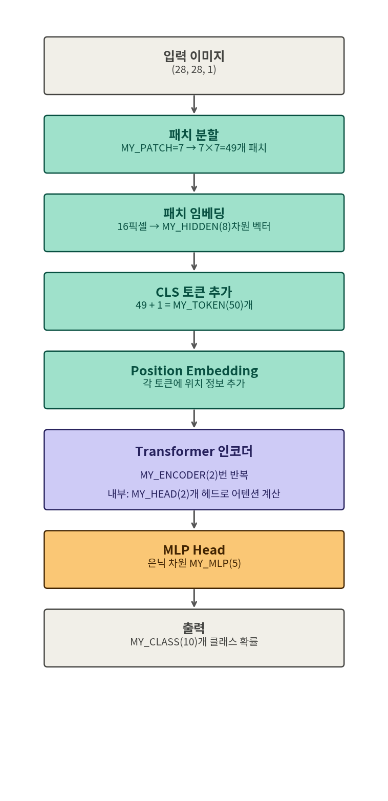

# Vision Transformer(ViT) 하이퍼파라미터 완전 정리

> 대상: MNIST 손글씨 숫자(0~9) 분류를 위한 ViT 실습 코드
> 목표: 코드에 등장하는 모든 하이퍼파라미터가 "무엇을, 왜" 결정하는지 이해한다

---

## 0. 들어가며 — ViT는 이미지를 어떻게 보는가?

일반 CNN은 이미지를 픽셀 격자 그대로 필터로 훑습니다. 반면 **ViT(Vision Transformer)** 는 이미지를 작은 조각(패치)으로 잘라서, 마치 문장을 단어로 쪼개듯 **"패치 시퀀스"** 로 바꾼 다음, 자연어 처리에서 쓰던 Transformer 구조를 그대로 적용합니다.

```
이미지 → 패치로 자르기 → 벡터로 변환(임베딩) → Transformer 인코더 → 분류
```

아래 하이퍼파라미터들은 이 파이프라인의 각 단계를 결정합니다. 전체 흐름은 아래 그림을 먼저 보고 시작하면 이해가 훨씬 쉽습니다.



---

## 1. 전체 코드

```python
# 2번 블락
# 하이퍼 파라미터

MY_SHAPE = (28,28,1)    # 손 글씨 이미지 데이터 모양, 28 : 가로, 28: 세로, 1 : channel(1:흑백, 3:컬러)
MY_EPOCH = 1            # 반복 학습 수
MY_BATCH = 128          # 배치 수(6만개의 데이터 중 1번에 학습하는 수)
MY_LEARN = 0.005        # 학습율
MY_CLASS = 10           # 분류화 대상의 수(몇 개의 클라스가 있느냐?)
MY_PATCH = 7            # 패치 크기(한 면의 패치 수)
MY_TOKEN = 50           # 총 입력 토큰 수 (49개 패치 더하기 1개 추가)
MY_ENCODER = 2          # 총 인코더 수
MY_MLP = 5              # multi-layer perceptron 차원 수

MY_HIDDEN = 8           # 패치 임베딩 차원 수
MY_HEAD = 2             # 어텐션 동시 계산 머리 수
```

---

## 2. 전체 파라미터 한눈에 보기

| 변수 | 값 | 분류 | 역할 |
|---|---|---|---|
| `MY_SHAPE` | (28,28,1) | 데이터 | 입력 이미지 크기 (가로, 세로, 채널) |
| `MY_EPOCH` | 1 | 학습 설정 | 전체 데이터셋을 반복 학습하는 횟수 |
| `MY_BATCH` | 128 | 학습 설정 | 한 번의 가중치 업데이트에 쓰는 이미지 개수 |
| `MY_LEARN` | 0.005 | 학습 설정 | 학습률(learning rate) |
| `MY_CLASS` | 10 | 데이터 | 분류할 클래스 개수 (숫자 0~9) |
| `MY_PATCH` | 7 | ViT 구조 | 한 면당 패치 개수 (7×7 = 49개 패치) |
| `MY_TOKEN` | 50 | ViT 구조 | 전체 토큰 수 (패치 49개 + CLS 1개) |
| `MY_ENCODER` | 2 | ViT 구조 | Transformer 인코더 반복 층 수 |
| `MY_MLP` | 5 | ViT 구조 | 분류용 MLP Head의 은닉 차원 |
| `MY_HIDDEN` | 8 | ViT 구조 | 패치 임베딩(토큰) 벡터의 차원 |
| `MY_HEAD` | 2 | ViT 구조 | 멀티헤드 어텐션의 head 개수 |

이 중 위쪽 5개(`MY_SHAPE` ~ `MY_CLASS`)는 일반적인 딥러닝 모델에도 공통으로 등장하는 값이고, 아래쪽 6개(`MY_PATCH` ~ `MY_HEAD`)가 **ViT 고유의 구조를 결정하는 값**입니다. 이 문서는 아래쪽 6개를 중심으로 자세히 설명합니다.

---

## 3. 기본 학습 설정 (공통 하이퍼파라미터)

### 3.1 `MY_SHAPE = (28,28,1)`

- 가로 28픽셀, 세로 28픽셀, 채널 1(흑백)의 이미지를 입력으로 받는다는 뜻입니다.
- 채널이 3이면 컬러(RGB) 이미지를 의미합니다.

### 3.2 `MY_EPOCH = 1`

- 6만 장의 학습 데이터를 몇 번 반복해서 학습할지 결정합니다.
- 실습에서는 빠른 확인을 위해 1로 설정했지만, 실제 성능을 높이려면 보통 5~20 이상으로 늘립니다.

### 3.3 `MY_BATCH = 128`

- 6만 장의 데이터를 한 번에 다 넣지 않고, 128장씩 묶어서 학습합니다.
- 배치 단위로 가중치를 업데이트하기 때문에 메모리 사용량과 학습 속도에 직접 영향을 줍니다.

### 3.4 `MY_LEARN = 0.005`

- 학습률(learning rate)이란, 가중치를 한 번 업데이트할 때 얼마나 크게 움직일지를 결정하는 값입니다.

| 학습률이 클 때 | 학습률이 작을 때 |
|---|---|
| 학습이 빨리 끝남 | 학습이 느리게 끝남 |
| 정확도가 떨어질 수 있음 | 정확도가 좋아지는 경향 |
| 최적점 근처에서 왔다 갔다 하며 수렴하지 못할 위험 | 지역 최솟값에 갇히거나 학습 시간이 오래 걸릴 위험 |

> 비유: 산 정상(최적점)을 찾아 내려가는데, 보폭(학습률)이 너무 크면 정상을 계속 지나쳐 버리고, 너무 작으면 도착하는 데 시간이 오래 걸립니다.

### 3.5 `MY_CLASS = 10`

- 분류 대상 클래스 개수. MNIST는 숫자 0~9, 총 10개의 클래스를 분류합니다.

---

## 4. ViT 구조 파라미터 (핵심)

### 4.1 `MY_PATCH = 7` — 패치 분할

> ⚠️ **가장 헷갈리는 부분**: 변수 이름은 "패치 크기"지만, 실제 값은 **"픽셀 크기"가 아니라 "한 면에 들어가는 패치의 개수"** 입니다.

- `MY_PATCH = 7` → 이미지를 **가로 7개 × 세로 7개**, 즉 **7×7 = 49개**의 작은 조각(패치)으로 나눕니다.
- 패치 하나의 실제 픽셀 크기는 다음과 같이 계산됩니다.

```
패치 한 변의 픽셀 수 = 이미지 한 변의 픽셀 수 ÷ MY_PATCH
                    = 28 ÷ 7
                    = 4 (픽셀)

→ 패치 1개 = 4 × 4 = 16 픽셀
→ 전체 패치 수 = 7 × 7 = 49 개
```

아래 그림은 28×28 이미지가 실제로 어떻게 49개의 조각으로 나뉘는지 보여줍니다. 주황색으로 표시된 칸이 패치 1개(4×4 픽셀)입니다.


**예시 실행 결과 (개념 확인용):**

```python
image_size = 28
my_patch = 7

patch_pixel = image_size // my_patch      # 한 변의 픽셀 수
total_patches = my_patch * my_patch       # 전체 패치 수

print(f"패치 한 변의 픽셀 수: {patch_pixel}")
print(f"패치 하나의 픽셀 개수: {patch_pixel * patch_pixel}")
print(f"전체 패치 개수: {total_patches}")
```

```
패치 한 변의 픽셀 수: 4
패치 하나의 픽셀 개수: 16
전체 패치 개수: 49
```

### 4.2 `MY_TOKEN = 50` — 총 토큰 수

Transformer는 원래 자연어의 "단어 토큰 시퀀스"를 입력으로 받도록 설계되었습니다. ViT는 이미지의 패치를 "토큰"처럼 취급해서 이 구조를 그대로 재사용합니다.

- 패치 49개 = 이미지 정보를 담은 토큰 49개
- 여기에 **CLS(classification) 토큰**을 1개 추가로 붙입니다.
  - CLS 토큰은 이미지 어느 한 부분의 정보가 아니라, **인코더를 거치면서 이미지 전체의 정보를 요약해서 담는 특수 토큰**입니다.
  - 최종 분류를 할 때는 49개 패치 토큰이 아니라, 이 CLS 토큰 하나의 결과만 MLP Head에 넘겨줍니다.

```
MY_TOKEN = 패치 개수(49) + CLS 토큰(1) = 50
```

| 순서 | 토큰 | 설명 |
|---|---|---|
| 0 | CLS 토큰 | 이미지 전체를 요약하는 대표 토큰 (학습되는 파라미터) |
| 1 ~ 49 | 패치 토큰 | 이미지의 각 4×4 조각을 벡터로 변환한 토큰 |

### 4.3 `MY_ENCODER = 2` — 인코더 반복 횟수

- Transformer 인코더 블록(Self-Attention + Feed Forward 조합)을 몇 층 쌓을지 정합니다.
- 원조 ViT 논문(ViT-Base)은 12층을 쌓지만, 이 실습에서는 MNIST처럼 비교적 단순한 데이터를 다루고 학습 속도를 확보하기 위해 **2층**으로 줄였습니다.
- 층이 깊어질수록 더 복잡한 패턴을 학습할 수 있지만, 계산량과 과적합 위험도 함께 증가합니다.

### 4.4 `MY_MLP = 5` — MLP Head 은닉 차원

- 인코더를 모두 통과한 CLS 토큰을 최종적으로 10개 클래스 중 하나로 분류하기 위해 거치는 **작은 완전연결층(MLP Head)**의 은닉 차원 수입니다.
- 값이 클수록 표현력은 늘어나지만, 그만큼 파라미터 수도 늘어납니다.

### 4.5 `MY_HIDDEN = 8` — 패치 임베딩 차원

패치 하나는 원래 16개(4×4)의 픽셀값으로 이루어져 있습니다. 이 16개의 숫자를 그대로 쓰지 않고, **선형 변환(Linear Projection)**을 거쳐 `MY_HIDDEN` 차원의 벡터로 바꿉니다.

```
패치 1개 (16개 픽셀값)
   ↓ Linear Projection (학습되는 가중치)
8차원 임베딩 벡터
```

- 이 8차원이 Transformer 내부에서 각 토큰(패치)을 표현하는 **"특징 벡터"의 크기**가 됩니다.
- CLS 토큰과 Position Embedding도 모두 이 `MY_HIDDEN`과 같은 차원(8차원)을 가져야 서로 더할 수 있습니다.

| MY_HIDDEN 값 | 표현력 | 계산량/학습 시간 |
|---|---|---|
| 작음 (예: 8) | 낮음 | 빠름 |
| 큼 (예: 128, 768) | 높음 | 느림 |

> 실제 논문의 ViT-Base는 `MY_HIDDEN`에 해당하는 값으로 768을 사용합니다. 실습에서는 학습 속도를 위해 8처럼 아주 작은 값을 씁니다.

### 4.6 `MY_HEAD = 2` — 멀티헤드 어텐션 head 수

Self-Attention은 "이 토큰이 다른 토큰들을 얼마나 주목해야 하는가"를 계산합니다. 이걸 하나의 관점으로만 보지 않고, **여러 개의 독립적인 관점(head)으로 나눠서 동시에** 계산하는 것이 멀티헤드 어텐션입니다.

아래 그림은 8차원 임베딩 벡터가 2개의 head(각 4차원)로 나뉘어 계산된 뒤, 다시 8차원으로 합쳐지는 과정을 보여줍니다.


**⚠️ 중요한 제약 조건**

```
MY_HIDDEN 은 반드시 MY_HEAD 로 나누어떨어져야 한다.

MY_HIDDEN ÷ MY_HEAD = head 하나가 담당하는 차원 수
       8   ÷    2    =           4   (정수 ✅)
```

나누어떨어지지 않으면(예: `MY_HIDDEN=8`, `MY_HEAD=3`) 코드 실행 시 차원 오류가 발생합니다.

**예시 실행 결과 (개념 확인용):**

```python
my_hidden = 8
my_head = 2

assert my_hidden % my_head == 0, "MY_HIDDEN은 MY_HEAD로 나누어떨어져야 합니다!"

head_dim = my_hidden // my_head
print(f"head 하나가 담당하는 차원 수: {head_dim}")
```

```
head 하나가 담당하는 차원 수: 4
```

> **오해하기 쉬운 부분**: head 수를 늘린다고 해서 학습 시간이 줄어드는 것은 아닙니다. 전체 차원(`MY_HIDDEN`)을 head 수만큼 나눠서 병렬적으로 여러 관점을 계산하는 것이 핵심 목적이며, 이를 통해 "표현력"이 좋아집니다. 다만 head 수가 GPU의 병렬 처리 효율과 맞물릴 수는 있으므로, 사용 중인 하드웨어 성능도 함께 고려하는 것이 좋습니다.

---

## 5. 전체 파이프라인 다시 보기

앞서 본 그림을 텍스트로도 한 번 더 정리하면 다음과 같습니다.

```
[입력 이미지]            (28, 28, 1)
      │
      ▼
[패치 분할]              MY_PATCH=7  →  7×7 = 49개 패치 (패치당 4×4 픽셀)
      │
      ▼
[패치 임베딩]             각 패치(16픽셀) → Linear Projection → MY_HIDDEN(8)차원 벡터
      │
      ▼
[CLS 토큰 추가]           49개 패치 토큰 + CLS 1개 = MY_TOKEN(50)개
      │
      ▼
[Position Embedding]     각 토큰에 위치 정보(8차원) 더하기
      │
      ▼
[Transformer 인코더]      MY_ENCODER(2)번 반복
      │   └ 내부에서 MY_HEAD(2)개의 head로 나눠 Self-Attention 계산
      ▼
[CLS 토큰만 추출]         50개 토큰 중 0번째(CLS) 토큰만 사용
      │
      ▼
[MLP Head]                은닉 차원 MY_MLP(5)를 거쳐 분류
      │
      ▼
[출력]                    MY_CLASS(10)개 클래스 확률
```

---

## 6. 파라미터 간의 의존 관계 정리

아래 관계들은 값을 바꿀 때 반드시 지켜야 하는 "규칙"입니다.

| 관계식 | 의미 |
|---|---|
| `MY_TOKEN = MY_PATCH × MY_PATCH + 1` | 패치 수의 제곱 + CLS 토큰 1개 |
| `MY_SHAPE[0] % MY_PATCH == 0` | 이미지 한 변이 패치 개수로 나누어떨어져야 함 (28 ÷ 7 = 4) |
| `MY_HIDDEN % MY_HEAD == 0` | 임베딩 차원이 head 개수로 나누어떨어져야 함 (8 ÷ 2 = 4) |

**연습 문제 (학생용)**

1. `MY_PATCH`를 4로 바꾸면, 패치 한 변의 픽셀 수와 전체 패치 개수, `MY_TOKEN`은 각각 얼마가 되어야 할까요?
2. `MY_HIDDEN=12`, `MY_HEAD=5`로 설정하면 어떤 문제가 발생할까요? 그 이유를 설명해 보세요.
3. `MY_ENCODER`를 2에서 6으로 늘리면 학습 시간과 정확도는 각각 어떻게 변할 것으로 예상되나요?

---

## 7. 다음 단계 미리보기

이번 하이퍼파라미터들을 실제로 사용하는 다음 구현 단계는 보통 다음 순서로 진행합니다 (TDD 방식 권장).

1. **패치 분할 함수** — 이미지를 49개의 4×4 패치로 자르는 함수
2. **패치 임베딩 레이어** — 16차원 패치를 `MY_HIDDEN`(8)차원으로 변환
3. **CLS 토큰 + Position Embedding** — 50개 토큰 구성
4. **멀티헤드 Self-Attention 레이어** — `MY_HEAD`(2)개로 나눠 계산
5. **Transformer 인코더 블록** — `MY_ENCODER`(2)번 반복
6. **MLP Head** — 최종 분류

각 단계마다 "예상 실행 결과 → 테스트 코드 → 구현 코드" 순서로 진행하면, 각 하이퍼파라미터가 실제로 어떤 shape(모양)의 텐서를 만드는지 눈으로 확인하면서 학습할 수 있습니다.
